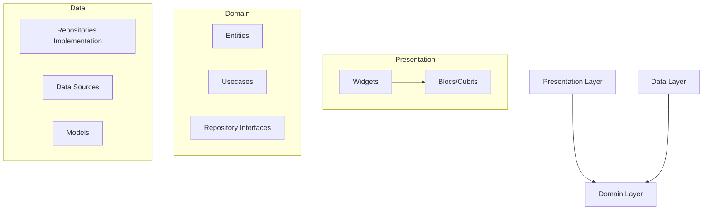

<div align="center">


# 🌙 Noor Islamic
**Count Together, Grow Together.**

[](https://flutter.dev)
[](https://firebase.google.com/)
[](https://pub.dev/packages/flutter_bloc)
[](https://blog.cleancoder.com/uncle-bob/2012/08/13/the-clean-architecture.html)

---

**Noor Islamic** is a premium, community-focused Flutter application designed for mindfulness and collective remembrance. It allows users to join "Live Rooms" for synchronized dhikr counting, fostering a sense of spiritual connection across the globe.

[Features](#-key-features) • [Tech Stack](#-technical-stack) • [Architecture](#-modular-architecture) • [Getting Started](#-getting-started)

</div>

## ✨ Key Features

### 📡 Real-time Live Rooms
Experience the power of collective counting. Join rooms hosted by others or create your own to synchronize your remembrance with a global community in real-time.

### 📳 Immersive Interaction
Interact with the app without even looking at the screen. Multiple input modes designed for mindfulness:
*   **Shake-to-Count**: Simply shake your device to increment the counter.
*   **Volume Keys**: Use physical buttons for tactile feedback.
*   **Full-Screen Touch**: Tap anywhere on the vibrant, minimalist interface.
*   **Haptic Feedback**: Subtle vibrations provide confirmation for every count.

### 🎯 Collective Goals
Set goals for your rooms. Track the progress of the entire community as everyone works together to reach a spiritual milestone.

### 💳 Premium Room Hosting
Acquire tickets via a secure **Stripe** integration to host your own featured rooms and lead the community.

---

## 🛠 Technical Stack

Noor Islamic is built with a focus on performance, scalability, and maintainability:

*   **Framework**: [Flutter](https://flutter.dev) (Dart)
*   **State Management**: [Bloc/Cubit](https://pub.dev/packages/flutter_bloc) for predictable state transitions.
*   **Backend Services**: 
    *   **Firebase Authentication**: Secure user sign-in.
    *   **Cloud Firestore**: For persistent room and user metadata.
    *   **Real-time Database**: For ultra-low latency counter synchronization.
    *   **Firebase Cloud Messaging (FCM)**: Remote notifications for live events.
*   **Payments**: [Stripe SDK](https://pub.dev/packages/flutter_stripe) for secure transactions.
*   **Local Storage**: [Hive](https://pub.dev/packages/hive) for high-performance localized caching.
    *   **Dependency Injection**: [GetIt](https://pub.dev/packages/get_it) for decoupled service management.
*   **Network**: [Dio](https://pub.dev/packages/dio) for robust HTTP requests.

---

## 🏗 Modular Architecture

The project follows the principles of **Clean Architecture**, ensuring that the business logic is independent of the UI and external frameworks.



### Folder Structure
*   `lib/core`: Shared utilities, themes, constants, and dependency injection.
*   `lib/features`: Feature-based modularity (e.g., `live_room`, `auth`, `store`).
    *   `data/`: Raw data sources and repository implementations.
    *   `domain/`: Business logic, entities, and repository definitions.
    *   `presentation/`: UI components and state management.

---

## 🚀 Getting Started

### Prerequisites
*   Flutter SDK (^3.11.4)
*   Operating System: iOS / Android / Web
*   Firebase Project

### Installation

1.  **Clone the repository:**
    ```bash
    git clone https://github.com/your-username/tally_islamic.git
    cd tally_islamic
    ```

2.  **Install dependencies:**
    ```bash
    flutter pub get
    ```

3.  **Setup Firebase:**
    *   Add your `google-services.json` (Android) and `GoogleService-Info.plist` (iOS).
    *   Enable Auth, Firestore, and Real-time Database in the console.

4.  **Configure Environment:**
    *   Create a `.env` file in the root directory based on the provided configuration for Stripe and other services.

5.  **Run the app:**
    ```bash
    flutter run
    ```

---

## 🤝 Contributing

We welcome contributions from the community! Whether it's fixing a bug, suggesting a feature, or improving documentation.

1.  Fork the Project
2.  Create your Feature Branch (`git checkout -b feature/AmazingFeature`)
3.  Commit your Changes (`git commit -m 'Add some AmazingFeature'`)
4.  Push to the Branch (`git push origin feature/AmazingFeature`)
5.  Open a Pull Request

---

## 📄 License

This project is licensed under the MIT License - see the `LICENSE` file for details.

---

<div align="center">
Built with ❤️ for the Ummah.
</div>
