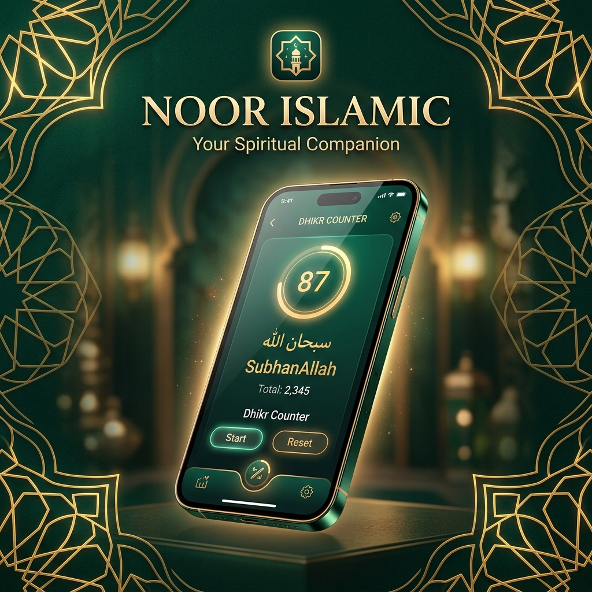
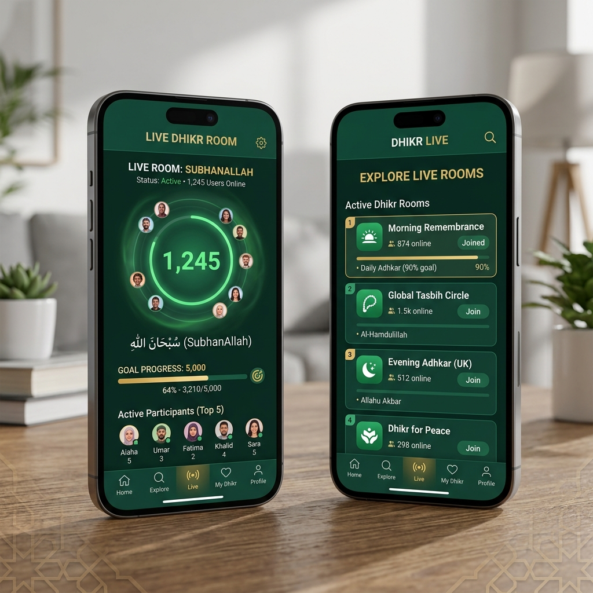
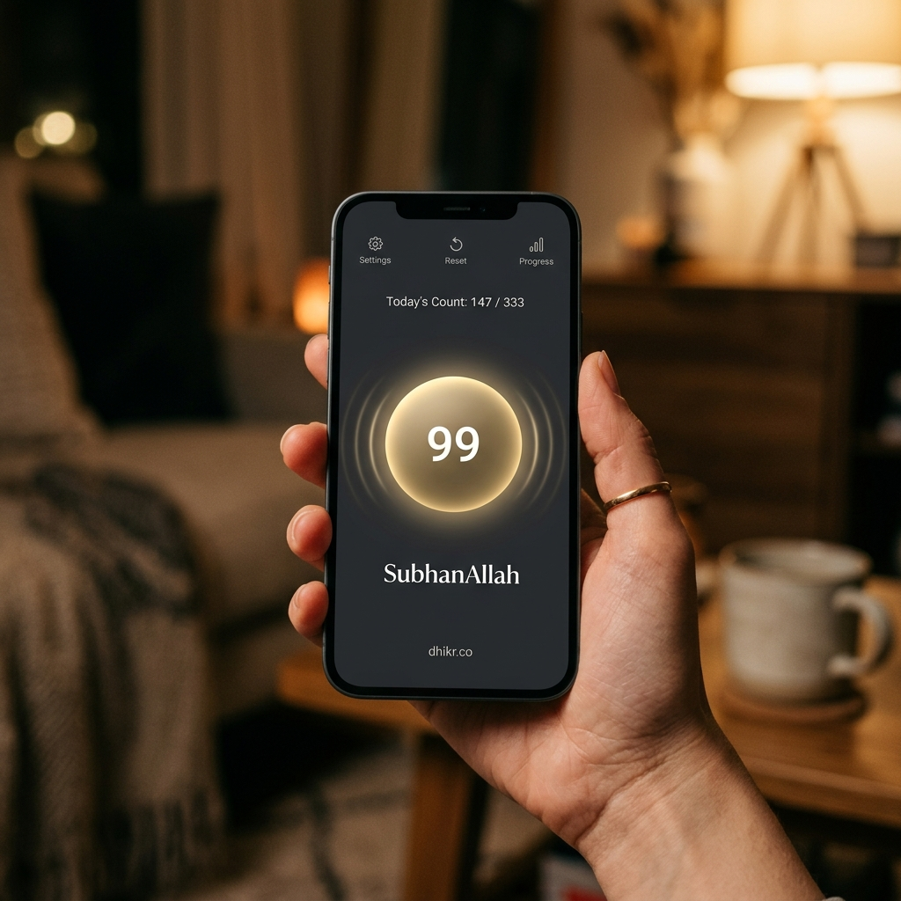
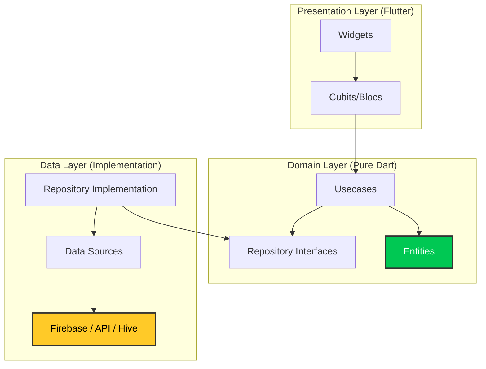

<div align="center">



# 🌙 Noor Islamic
### **Count Together, Grow Together.**

[](https://flutter.dev)
[](https://firebase.google.com/)
[](https://pub.dev/packages/flutter_bloc)
[](https://blog.cleancoder.com/uncle-bob/2012/08/13/the-clean-architecture.html)

</div>

---

## 🎯 Project Goal

The core mission of **Noor Islamic** is to bridge the gap between individual spiritual practice and global community connection. In an increasingly digital world, we aim to provide a sanctuary for the Ummah to engage in synchronized remembrance (dhikr). 

By leveraging real-time synchronization technology, Noor Islamic transforms the solitary act of counting into a collective journey, fostering a sense of shared purpose, spiritual accountability, and global brotherhood/sisterhood. Our goal is to make constant remembrance accessible, engaging, and deeply rooted in community.

---

## ✨ Key Features

### 📡 Real-time Live Rooms
Experience the power of collective dhikr. Join rooms hosted by others or lead your own to synchronize your remembrance with a global community in real-time.

<p align="center">
  
</p>

### 📳 Immersive Interaction
Interact with the app without distraction. Designed for deep mindfulness with multiple input modes:
*   **Shake-to-Count**: Increment your counter with a simple gesture.
*   **Physical Feedback**: Full support for volume keys and haptic vibrations.
*   **Minimalist UI**: Tap anywhere on the vibrant, clutter-free interface.

<p align="center">
  
</p>

### 💳 Premium Room Hosting
Acquire "Hosting Tickets" via secure **Stripe** integration to feature your rooms and lead the community milestones.

<p align="center">
  
</p>

---

## 🏗 Full Project Structure (Clean Architecture)

Noor Islamic is built with a strict separation of concerns, ensuring high maintainability and testability.

```text
.
├── lib
│   ├── main.dart                      # App entry & service bootstrap
│   ├── firebase_options.dart          # Firebase platform config
│   ├── core                           # Shared Architectural Core
│   │   ├── di                         # GetIt Service Locator setup
│   │   ├── env                        # DotEnv environment management
│   │   ├── router                     # GoRouter declarative routing
│   │   ├── api                        # Base Dio API service & interceptors
│   │   ├── error                      # Failure & Exception handling
│   │   ├── services                   # Global Services (FCM, Local Notifications)
│   │   ├── theme                      # Design tokens (Colors, Text Styles)
│   │   ├── utils & helper             # Global extension methods & UI helpers
│   │   └── widgets                    # Atomic UI components (Buttons, Fields)
│   └── features                       # Vertical Slices (Feature Modules)
│       └── [feature_name]             # e.g., live_room, auth, store
│           ├── domain                 # Business Logic (Pure Dart)
│           │   ├── entity             # Plain Data Objects
│           │   ├── repo               # Repository Interfaces
│           │   └── usecase            # Specific Business Scenarios
│           ├── data                   # Data Logic (Implementation)
│           │   ├── datasource         # Remote/Local data fetchers
│           │   ├── model              # JSON serialization & mapping
│           │   └── repo               # Repository Implementations
│           └── presentation           # UI Logic (Flutter)
│               ├── cubit              # BLoC State Management
│               └── widgets/view       # UI Layer components
├── assets
│   ├── images                         # Branding & Onboarding
│   ├── avatars                        # User profile SVG assets
│   └── readme                         # Documentation assets
├── test                               # Symmetrical Testing Hierarchy
│   ├── features                       # Feature unit & widget tests
│   └── core                           # Shared components verification
└── docs                               # Supplementary technical guides
```

---

## 🛠 Dependency Orchestration

| Dependency | Purpose | Implementation Layer |
| :--- | :--- | :--- |
| **Flutter BLoC** | State Management & Event Handling | `Presentation` (Cubits/Blocs) |
| **Firebase Services** | Authentication, RTDB, Firestore, FCM | `Data` (Datasources) / `Core` (Services) |
| **Flutter Stripe** | Secure Payment Processing & Tokenization | `Features/Store`, `Features/AddCard` |
| **Go Router** | Declarative Routing & Deep Linking | `Core/Router` |
| **Hive Flutter** | Ultra-fast NoSQL Local Storage | `Data` (Auth/Splash caching) |
| **Get It** | Dependency Injection & Service Locating | `Core/Di` |
| **Dio** | Robust HTTP Client with Interceptors | `Core/Api` |
| **Sensors Plus** | Shake-to-Count Gesture Detection | `Features/LiveRoom` (Runtime logic) |

---

## 🧰 Essential Developer Toolchain

To maintain the high quality and performance of Noor Islamic, we utilize the following specialized tools:

*   **Device Preview**: Enables real-time UI/UX testing across multiple simulated device sizes and locales.
*   **Flutter Launcher Icons**: Automates the generation of adaptive icons for both Android and iOS.
*   **DartZ**: Provides functional programming constructs (Either, Left, Right) to handle errors gracefully in the Domain layer.
*   **Shimmer & Confetti**: Enhances user experience with high-quality visual feedback and loading states.
*   **Firebase Messaging**: Powers the remote notification engine for live room activations.

---

## 🏗 Modular Architecture



---

## 🚀 Getting Started

1.  **Clone & Install**:
    ```bash
    git clone https://github.com/your-username/tally_islamic.git
    flutter pub get
    ```

2.  **Environment Setup**:
    Add your `.env` to `assets/` and run `flutterfire configure` to generate `firebase_options.dart`.

3.  **Run**:
    ```bash
    flutter run
    ```

---

<div align="center">

Built with ❤️ for the global Ummah.
*May this work be a source of constant dhikr and blessing.*

</div>
